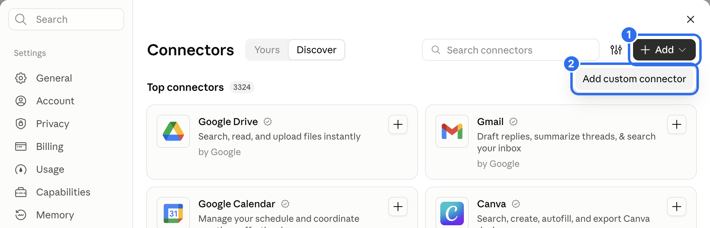
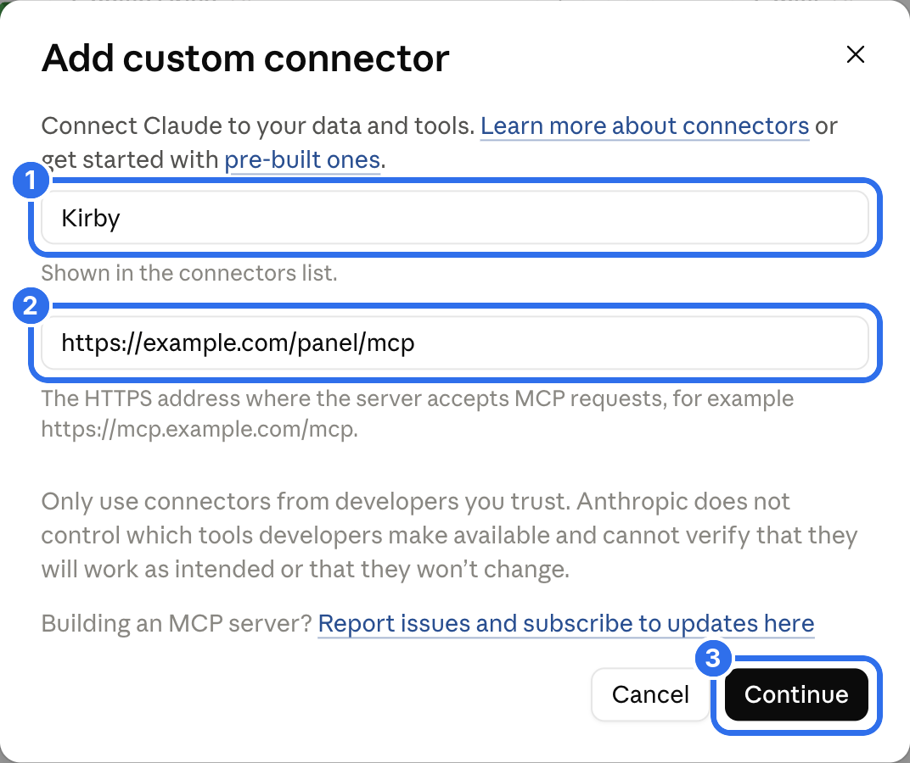
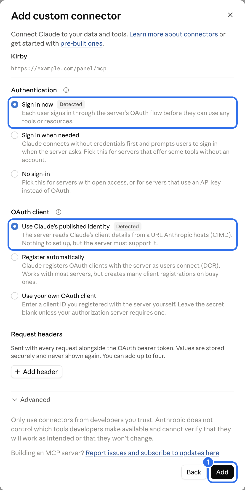
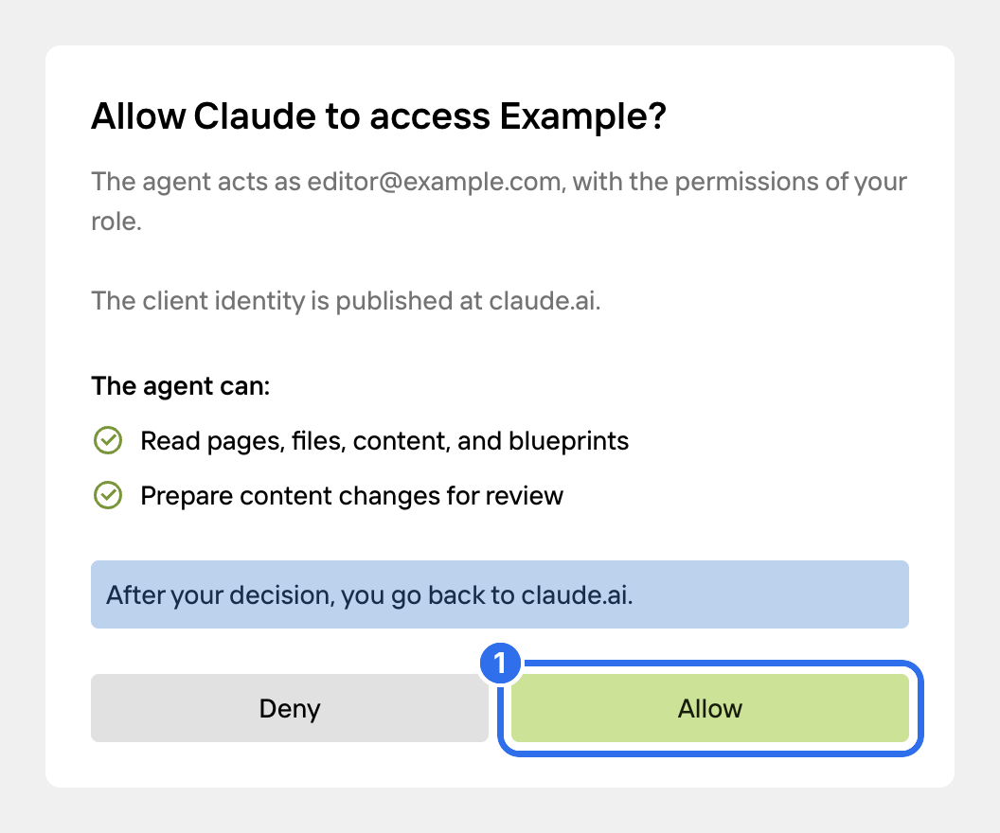
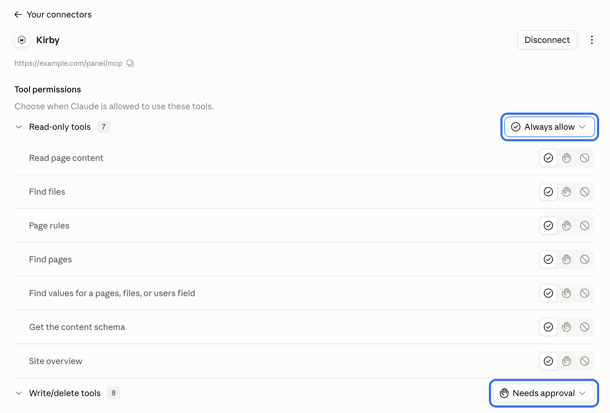
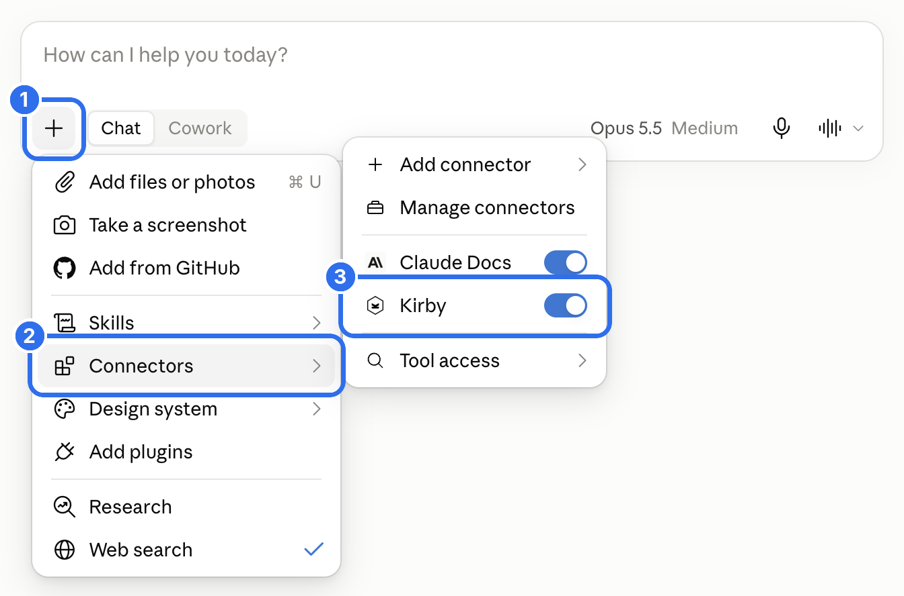
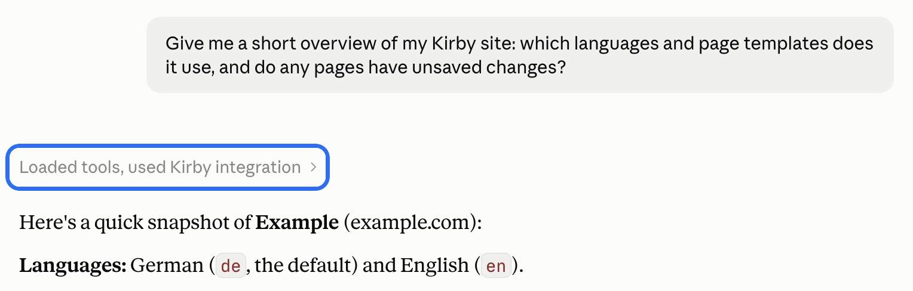
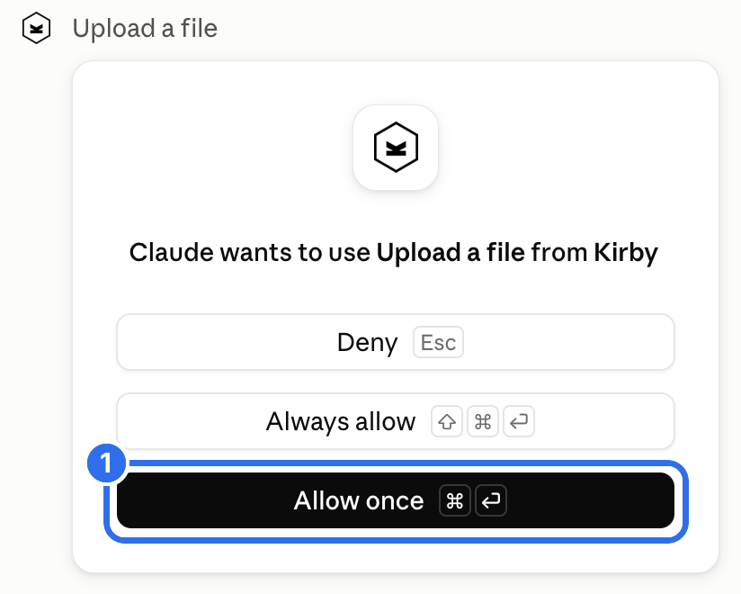
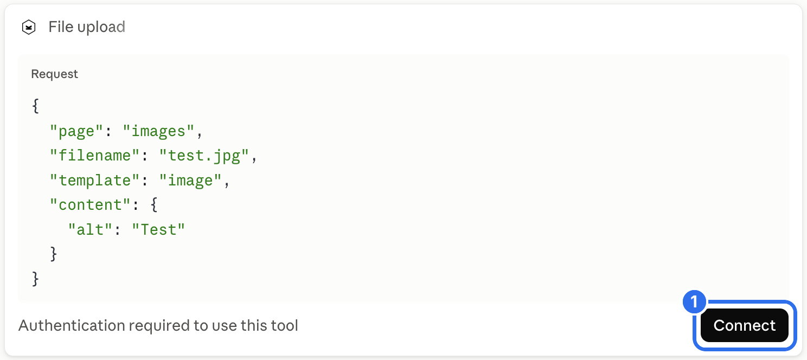
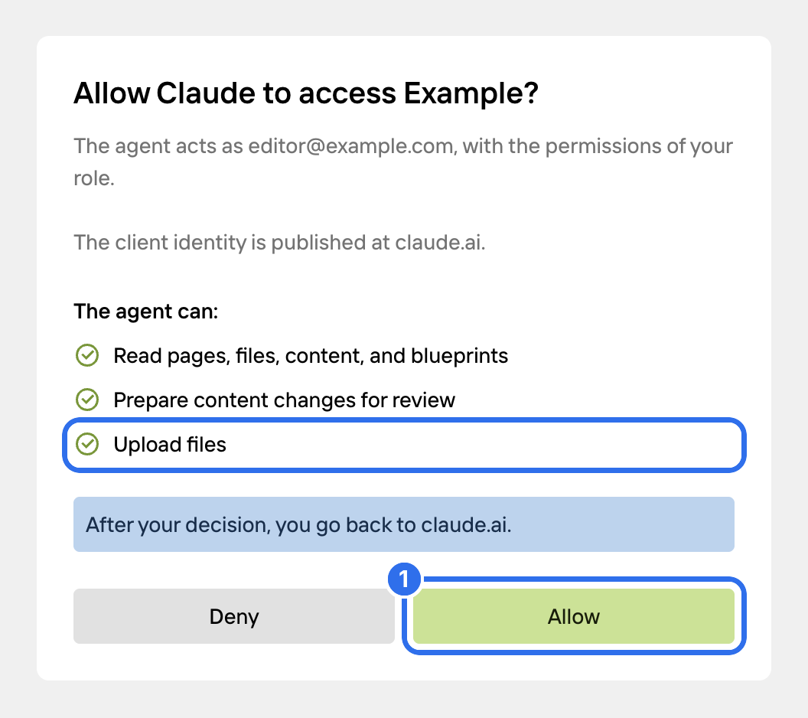

Claude connects to your Kirby site as a custom connector. You add it once on claude.ai, and you can then use it in Claude Desktop and the Claude mobile apps too.

## Add the connector

Copy the **MCP URL** from the **Agents** view in the Panel. Open [claude.ai](https://claude.ai) and go to **Customize** → **Connectors** in the sidebar. Click **Add** (1) and choose **Add custom connector** (2).



Enter a name (1). Your editors see this name in Claude, so use the name of your site. Paste the MCP URL into the second field (2) and click **Continue** (3).



Claude detects the authentication settings. Keep the two options with the **Detected** label and click **Add** (1).



## Allow access

Claude opens the Panel in a new window. Log in if you aren't logged in yet.

The consent screen shows the Kirby user that Claude acts as and what Claude is allowed to do. By default, Claude can read your content and prepare changes for review. Click **Allow** (1).



The connector shows as connected in Claude. The connection is listed in the **Agents** view in the Panel. There you can change its permissions or revoke it.

The consent screen expires after 10 minutes. If it says that the request has expired, close the window and click **Connect** on the connector in Claude.

## Choose when Claude asks you

The page of the connector lists the tools in two groups: read-only tools and tools that change content. For each group, you choose if Claude may use the tools without asking.



We recommend **Always allow** for the read-only tools and **Needs approval** for the tools that change content. Claude then asks before each change.

## Use it in a chat

The connector is on in new chats by default. To turn it off for a chat, click **+** (1) in the message field, open **Connectors** (2) and use the switch next to the connector (3).



Ask your question. Claude calls the tools it needs and shows them in the chat.



## When Claude needs more permissions

By default, Claude can read your content and prepare changes for review. Other tools, like publishing, creating pages or uploading files, need an extra permission. Claude asks for it the first time it uses one of these tools.

If the tool is set to **Needs approval**, Claude asks before the tool call. Click **Allow once** (1).



Below the tool call, Claude shows that the permission is missing. Click **Connect** (1).



The consent screen lists the new permission. Click **Allow** (1).



Claude runs the tool again without a new message. The connection keeps the new permission until you remove it in the **Agents** view.

Claude doesn't show tools for actions that your role can't do in the Panel.

## Claude Code

Claude Code doesn't use the connectors from claude.ai. Add your site in a terminal:

```bash
claude mcp add --transport http kirby https://example.com/panel/mcp
```

Start `claude`, type `/mcp`, select `kirby` and choose **Authenticate**. The browser opens the Kirby login and the consent screen.

Claude Code can also connect to a local development site, for example `http://localhost:8000/panel/mcp`. Kirby Agents allows plain HTTP only for local addresses.

## Good to know

- Custom connectors are available on all Claude plans. On the Free plan, you can add one custom connector.
- On Team and Enterprise plans, only an owner can add the connector for the organization. Every member then connects with their own Kirby account.
