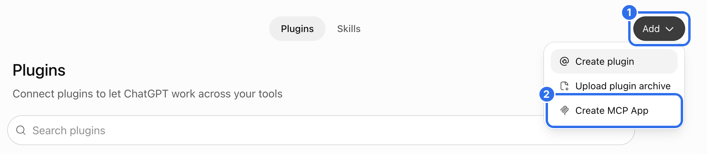
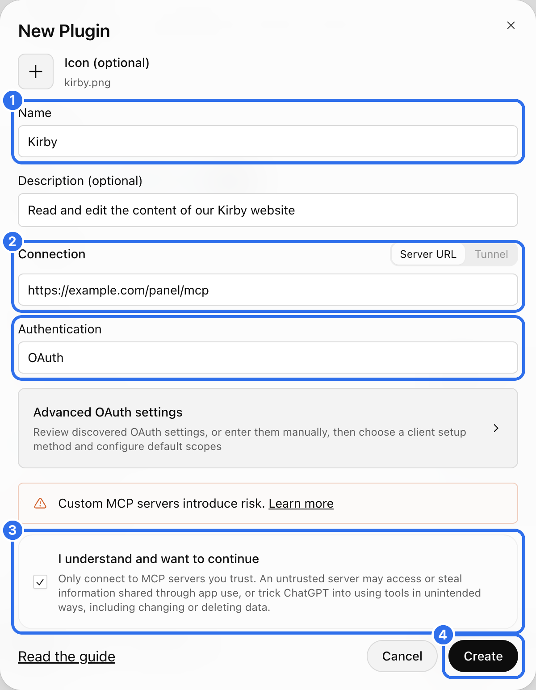
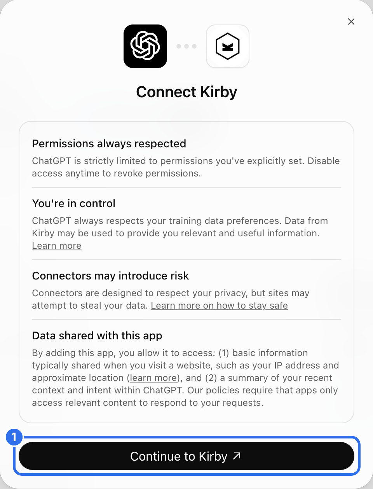
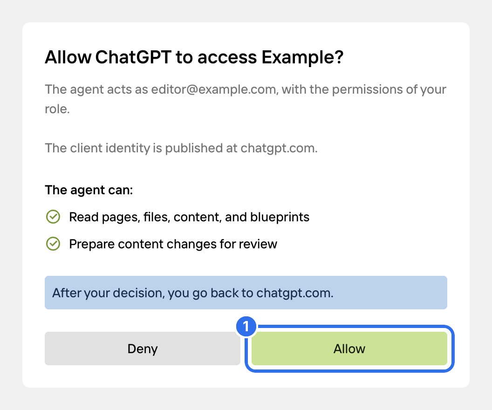
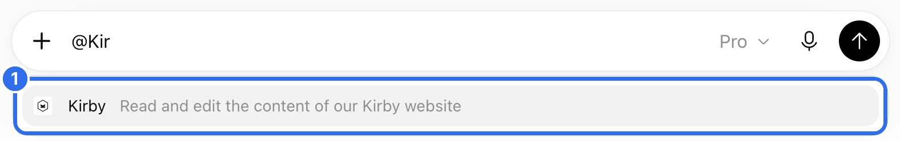
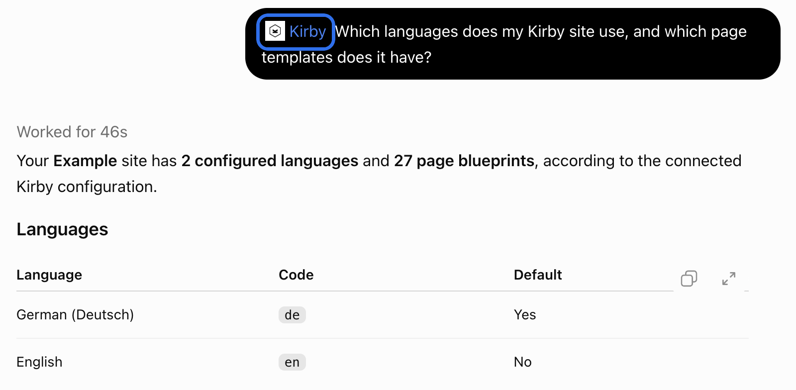
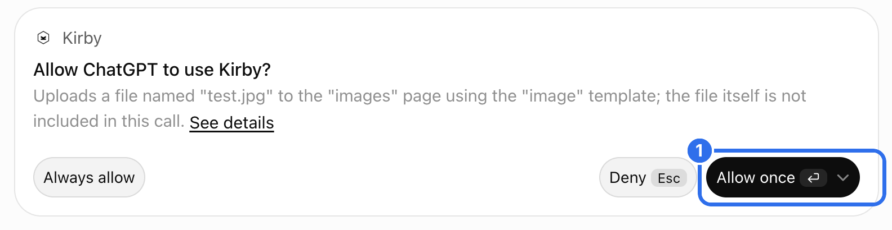
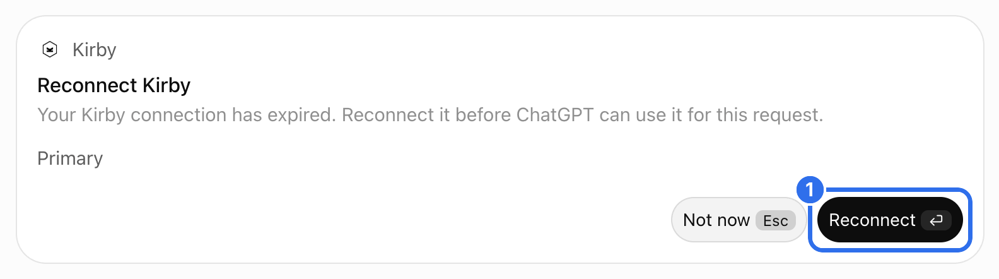
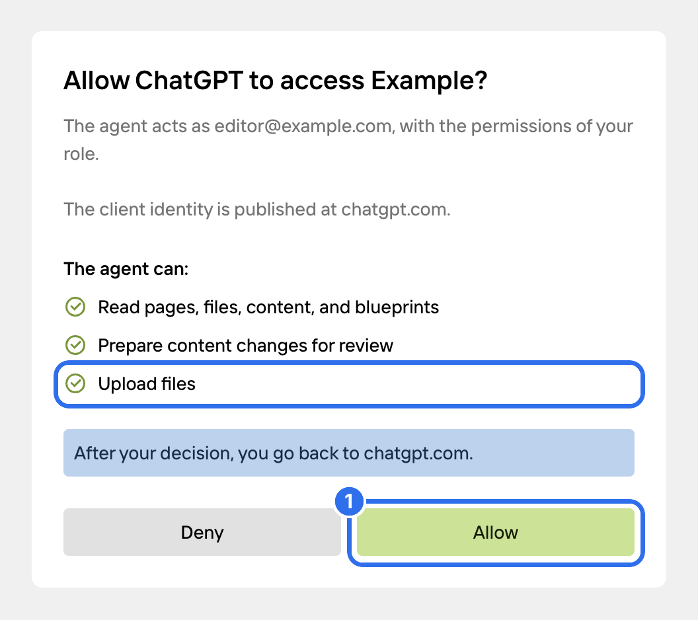

ChatGPT connects to your Kirby site as an MCP app. You add it once on chatgpt.com and can then use it in every chat.

## Add the app

Copy the **MCP URL** from the **Agents** view in the Panel. Open [chatgpt.com](https://chatgpt.com) and go to **Plugins** in the sidebar. Click **Add** (1) and choose **Create MCP App** (2).

Enter a name (1). The description and the icon are optional, ChatGPT shows both next to the app. Paste the MCP URL into the **Connection** field (2) and keep **OAuth** for the authentication. Confirm that you trust the server (3) and click **Create** (4).

Click **Continue to Kirby** (1).

## Allow access

Log in to the Panel if you aren't logged in yet.

The consent screen shows the Kirby user that ChatGPT acts as and what ChatGPT is allowed to do. By default, ChatGPT can read your content and prepare changes for review. Click **Allow** (1).

The app is listed under **Installed** on the Plugins page. The connection is listed in the **Agents** view in the Panel. There you can change its permissions or revoke it.

## Use it in a chat

Type `@` and the name of the app in the message field, and select the app (1).

Ask your question. ChatGPT calls the tools it needs.

ChatGPT asks before it uses a tool that changes something. Click **Allow once** (1), or **Always allow** to skip this question for the tool in the future.

By default, ChatGPT runs read-only tools without asking. To change this, go to **Settings** → **Plugins** and open the permission setting of the app.

## When ChatGPT needs more permissions

By default, ChatGPT can read your content and prepare changes for review. Other tools, like publishing, creating pages or uploading files, need an extra permission. ChatGPT asks for it the first time it uses one of these tools.

After the tool call, ChatGPT shows a card to reconnect Kirby. The card says that the connection has expired. This isn't correct: the connection works, it only needs the new permission. Click **Reconnect** (1).

The consent screen lists the new permission. Click **Allow** (1).

If the answer in ChatGPT ends with an error, click **Try again**. ChatGPT then runs the tool with the new permission.

### If ChatGPT doesn't ask

Not every ChatGPT model shows the reconnect card. In our tests, **Instant** showed it and **Pro** didn't. If the answer ends without the card, add the permission in the Panel:

1. Open the **Agents** view in the Panel.
2. Open the options of the ChatGPT connection and choose **Change permissions**.
3. Select the permissions and save.

Ask ChatGPT to try again. The new permission applies to the next request, so you don't have to connect again.

## Good to know

- Custom MCP apps need a paid ChatGPT plan.
- In Business and Enterprise workspaces, an admin may have to allow custom MCP apps first.
