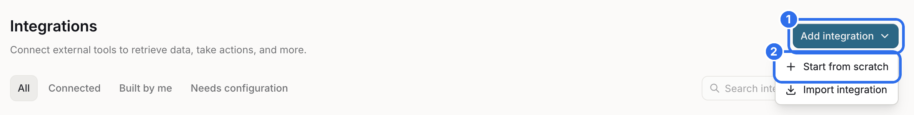
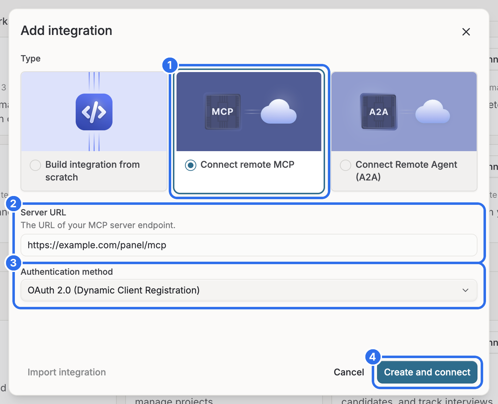
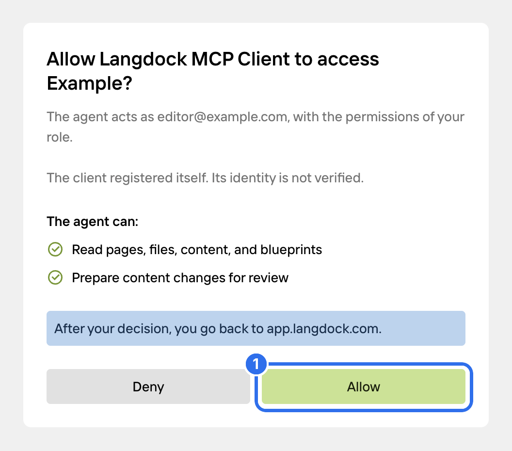
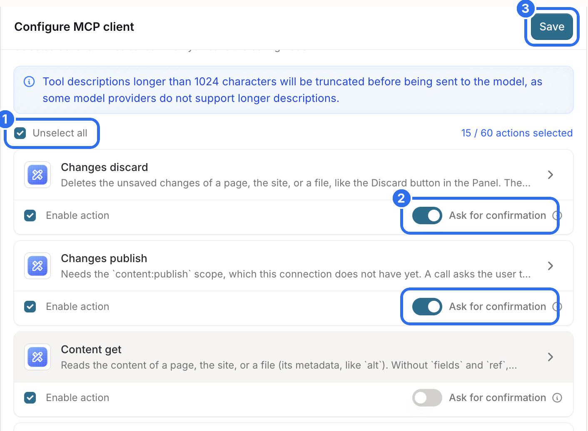
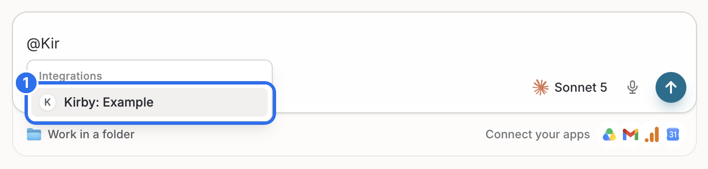
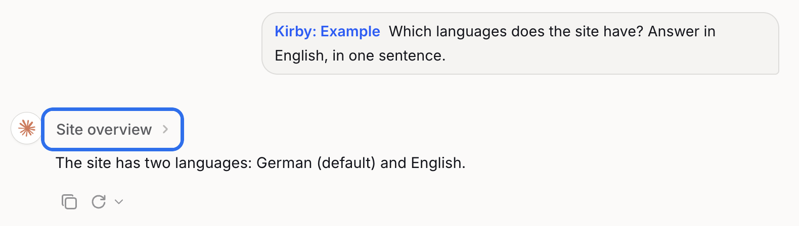
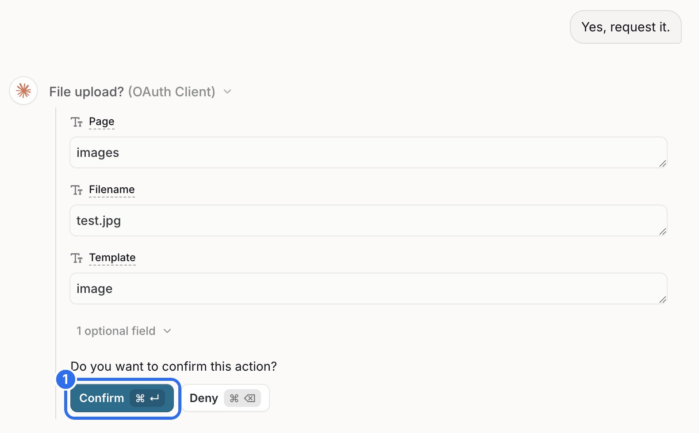

Langdock connects to your Kirby site as an MCP integration. To add it, you need the permission to create integrations in your Langdock workspace.

## Add the integration

Copy the **MCP URL** from the **Agents** view in the Panel. Open [app.langdock.com](https://app.langdock.com), open the profile menu at the bottom left and choose **Integrations**. Click **Add integration** (1) and choose **Start from scratch** (2).

Select **Connect remote MCP** (1). Paste the MCP URL into **Server URL** (2) and select **OAuth 2.0 (Dynamic Client Registration)** as the authentication method (3). Click **Create and connect** (4).

## Allow access

Log in to the Panel if you aren't logged in yet.

The consent screen shows the Kirby user that Langdock acts as and what Langdock is allowed to do. By default, Langdock can read your content and prepare changes for review. Langdock registers itself with your site, so the screen says that its identity is not verified. Click **Allow** (1).

Langdock names the integration after your site, for example "Kirby: Example". The connection is listed as "Langdock MCP Client" in the **Agents** view in the Panel. There you can change its permissions or revoke it.

## Choose the tools

Langdock only uses the tools that you turn on. On the page of the integration, click **List Server Features** and select all tools (1).

By default, Langdock runs all tools without asking. Turn on **Ask for confirmation** (2) for the tools that change content: Changes discard, Changes publish, Content update, File delete, File upload, Page create, Page delete and Page update. Click **Save** (3).

Langdock saves the list of tools. After an update of Kirby Agents, click **List Server Features** again and save.

## Use it in a chat

Type `@` and the name of the integration in the message field, and select the integration (1).

Ask your question. Langdock shows the tools it used above the answer.

Langdock asks before it uses a tool with confirmation turned on. Click **Confirm** (1).

## When Langdock needs more permissions

By default, Langdock can read your content and prepare changes for review. Other tools, like publishing, creating pages or uploading files, need an extra permission. Langdock can't ask for it during a chat: the tool call fails. Add the permission in the Panel:

1. Open the **Agents** view in the Panel.
2. Open the options of the Langdock connection and choose **Change permissions**.
3. Select the permissions and save.

Ask Langdock to try again. The new permission applies to the next request.

Langdock also shows a **Reauthorize** button when a permission is missing. This connects again with the default permissions, so it doesn't add the missing one.
