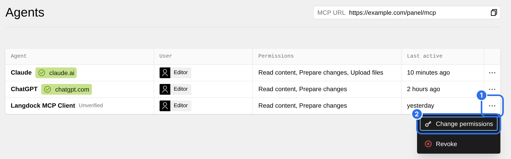
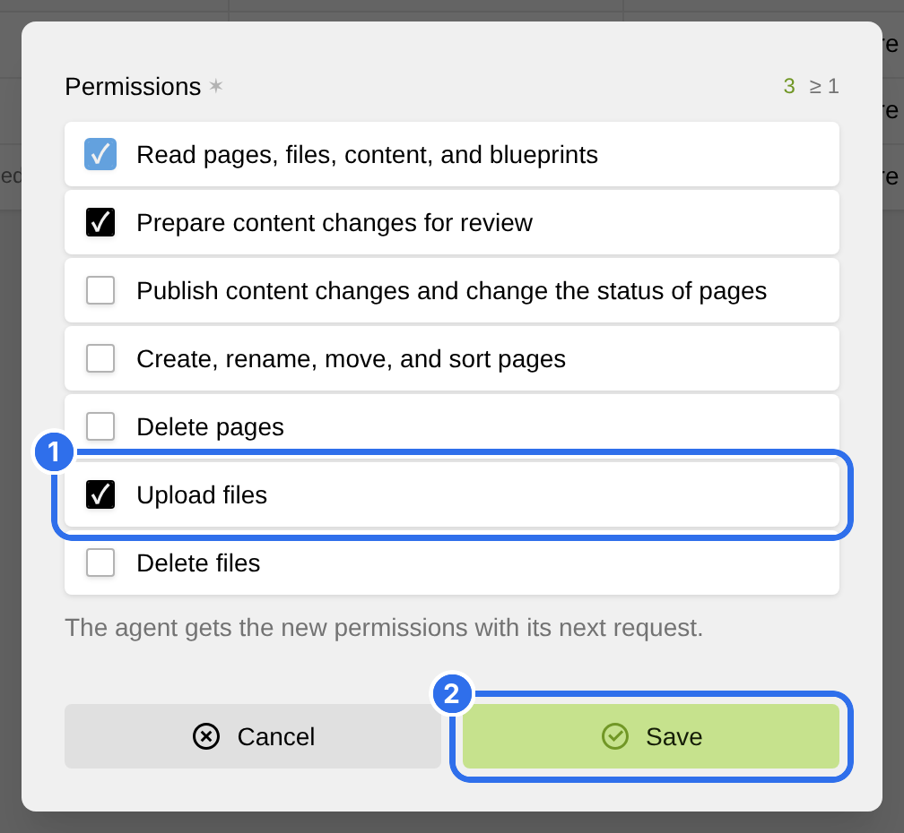

An agent acts as the Kirby user who connected it. It can only do what you allowed, and never more than the role of the user allows in the Panel.

A connection can have these permissions:

- Read pages, files, content, and blueprints
- Prepare content changes for review
- Publish content changes and change the status of pages
- Create, rename, move, and sort pages
- Delete pages
- Upload files
- Delete files

A new connection gets the first two. The agent can then read your site, and its changes wait as unsaved changes until you publish them in the Panel.

## Change the permissions

Open the **Agents** view in the Panel. Click the options of a connection (1) and choose **Change permissions** (2).

Select the permissions (1) and click **Save** (2). The agent gets them with its next request.

To remove the access of an agent, choose **Revoke** instead.

[Claude](0_getting-started/1_claude) and [ChatGPT](0_getting-started/2_chatgpt) can also ask for a missing permission during a chat.
